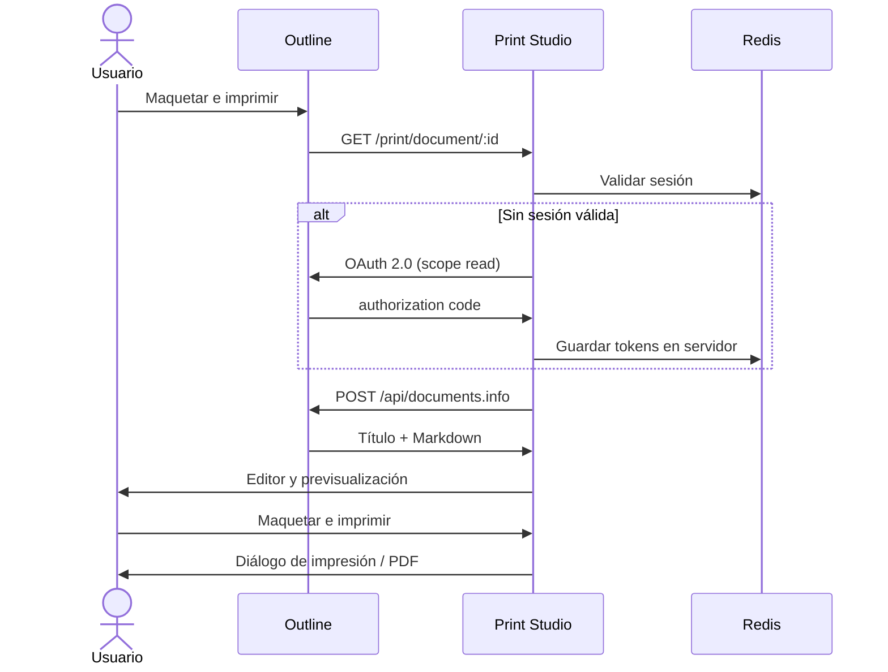

<div align="center">


# Print Studio for Outline

**Editor visual y maquetador profesional para convertir documentos Markdown de Outline en documentos paginados listos para imprimir o exportar a PDF.**

[](https://github.com/javij98/markdown-printer/tree/v0.7.0)
[](https://vuejs.org/)
[](./LICENSE)

</div>

Print Studio mantiene **Outline como fuente de verdad** y abre una copia de trabajo del documento para darle un acabado de impresión profesional. Combina edición Markdown, edición visual basada en Milkdown, previsualización paginada, plantillas editoriales y ajustes avanzados sin escribir cambios de vuelta en Outline.

> Este repositorio es un fork mantenido para la integración Outline + Print Studio. La versión estable actual es **v0.7.0**.

## Qué resuelve

La impresión directa de Markdown suele producir saltos poco naturales, bloques de código inconsistentes y una jerarquía visual demasiado básica. Print Studio añade una etapa de maquetación entre Outline y el PDF:

- abre un documento concreto mediante `/print/document/:id`;
- autentica al usuario contra Outline mediante OAuth 2.0;
- conserva títulos, listas, tablas, tareas, imágenes, avisos, toggles, código y fórmulas;
- permite editar en Markdown o en un editor visual;
- muestra páginas reales con tamaño, orientación y márgenes configurables;
- aplica plantillas de impresión o ajustes editoriales detallados;
- utiliza el diálogo nativo del navegador para imprimir o guardar como PDF.

## Funcionalidades principales

- **Dos modos de edición:** Markdown con CodeMirror 6 y editor visual con Milkdown/Crepe.
- **Previsualización paginada:** tamaños ISO, norteamericanos y fotográficos.
- **Plantillas de estilo:** Outline, Académico, Informe y Minimalista.
- **Ajustes avanzados:** tipografía, colores, ritmo vertical, encabezados, código, tablas, enlaces, alineación, justificación e hifenado.
- **Fidelidad con Outline:** avisos `:::info`, toggles, tareas, imágenes, saltos de página y normalización de saltos escapados.
- **Código legible:** resaltado de sintaxis y temas claro/oscuro coherentes.
- **Impresión profesional:** CSS de impresión aislado, fuentes embebidas y paginación mediante Paged.js.
- **Diseño responsive:** escritorio, tablet y móvil.
- **Sesión segura:** tokens OAuth almacenados en Redis; el navegador solo recibe una cookie de sesión opaca y `HttpOnly`.
- **Aislamiento documental:** cada documento abierto desde Outline se carga como copia temporal independiente.

## Flujo de uso



## Inicio rápido

### Requisitos

- Node.js 22 o superior.
- pnpm 10.
- Docker, para construir la imagen de producción.
- Redis y una instancia de Outline, para probar la integración completa.

### Interfaz en desarrollo

```bash
git clone --branch main https://github.com/javij98/markdown-printer.git
cd markdown-printer
pnpm install --frozen-lockfile
pnpm dev --host 0.0.0.0
```

Abre `http://localhost:5173/print/`. Este modo sirve para desarrollar la interfaz; OAuth y la carga real de documentos requieren el servidor de producción y Redis.

### Tests y build

```bash
pnpm test
pnpm build
```

### Imagen Docker

```bash
docker build -t outline-print-studio:0.7.0 .
```

La imagen expone el puerto `3000` y necesita todas las variables descritas en [`.env.print.example`](./.env.print.example). Consulta la [guía de despliegue](./docs/DEPLOYMENT.md) antes de conectarla a una instancia real.

## Documentación

| Documento | Contenido |
| --- | --- |
| [Arquitectura](./docs/ARCHITECTURE.md) | Componentes, flujo de datos, edición, renderizado e impresión. |
| [Integración con Outline](./docs/OUTLINE_INTEGRATION.md) | OAuth, rutas, permisos, botón de Outline y formato compatible. |
| [Despliegue](./docs/DEPLOYMENT.md) | Docker, Compose, proxy inverso, HTTPS, Redis y comprobaciones. |
| [Desarrollo](./docs/DEVELOPMENT.md) | Entorno local, estructura del código, tests y criterios de cambio. |
| [Versionado y releases](./docs/RELEASING.md) | SemVer, tags, imágenes y procedimiento de publicación. |
| [Solución de problemas](./docs/TROUBLESHOOTING.md) | OAuth, cookies, red, documentos, estilos e impresión. |
| [Historial de cambios](./CHANGELOG.md) | Cambios relevantes por versión. |
| [Contribución](./CONTRIBUTING.md) | Flujo de ramas, calidad y pull requests. |
| [Seguridad](./SECURITY.md) | Modelo de seguridad y comunicación de vulnerabilidades. |

## Arquitectura resumida

| Capa | Tecnología | Responsabilidad |
| --- | --- | --- |
| Interfaz | Vue 3 + PrimeVue | Estado, herramientas, paneles y experiencia responsive. |
| Editor Markdown | CodeMirror 6 | Edición del Markdown fuente y resaltado. |
| Editor visual | Milkdown/Crepe | Edición por bloques conservando Markdown. |
| Renderizado | Marked + extensiones | Conversión de Markdown y elementos de Outline a HTML. |
| Paginación | Paged.js + CSS de impresión | Vista por páginas y salida impresa. |
| Backend | Express 5 | OAuth, sesión, proxy controlado hacia Outline y estáticos. |
| Sesiones | Redis | Estado OAuth y tokens, siempre fuera del navegador. |

## Integración y seguridad

- El cliente OAuth solicita únicamente el scope `read`.
- `OUTLINE_TEAM_ID` restringe el acceso a un único workspace.
- Los tokens de acceso y refresco se guardan en Redis, nunca en `localStorage`.
- La cookie de sesión es `HttpOnly`, `Secure`, `SameSite=Lax` y se limita a `/print`.
- El estado OAuth caduca a los 10 minutos y las sesiones a los 30 días.
- Print Studio consulta el documento, pero **no guarda modificaciones en Outline**.
- Se recomienda servir Outline y Print Studio bajo el mismo dominio y siempre mediante HTTPS.

## Limitaciones conocidas

- El resultado final depende del motor de impresión del navegador; Chromium ofrece la ruta mejor probada.
- Encabezados y pies automáticos pertenecen al diálogo del navegador y deben desactivarse si se desea una salida limpia.
- Algunos bloques avanzados de Outline se protegen en el editor visual para evitar pérdida de información.
- Las pestañas de trabajo son temporales; Outline continúa siendo el repositorio documental persistente.
- La ruta pública está fijada a `/print/` en la configuración de Vite y en las cookies del servidor.

## Versiones

Las versiones estables siguen [Semantic Versioning](https://semver.org/lang/es/):

- **MAJOR:** cambios incompatibles de integración o datos.
- **MINOR:** funciones compatibles, nuevos editores o capacidades de impresión.
- **PATCH:** correcciones compatibles.
- **RC:** versiones candidatas, por ejemplo `v0.6.0-rc.5`.

El tag Git debe coincidir con la versión de los dos `package.json` y con la etiqueta de la imagen Docker. La política completa está en [RELEASING.md](./docs/RELEASING.md).

## Origen y licencia

El proyecto parte de [KOW-tools/markdown-printer](https://github.com/KOW-tools/markdown-printer) y añade la integración con Outline, el editor visual, la fidelidad de formato y el flujo profesional de impresión.

Distribuido bajo la licencia [Apache 2.0](./LICENSE).
