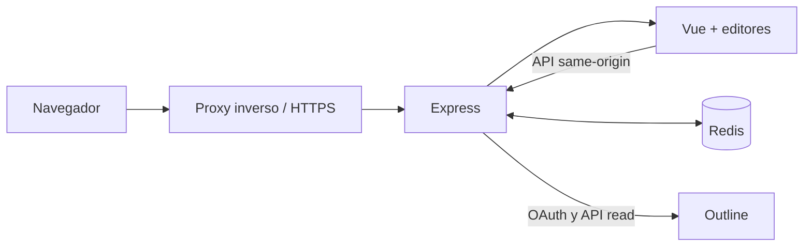

# Arquitectura

Este documento describe la arquitectura de Print Studio v0.7.0 y las decisiones que deben preservarse al evolucionar el proyecto.

## Objetivos de diseño

1. Mantener Outline como fuente persistente y canónica del contenido.
2. Ofrecer una copia de trabajo editable orientada a impresión.
3. Aproximar la representación visual de Outline sin sacrificar controles editoriales.
4. No exponer tokens OAuth al frontend.
5. Producir una salida reproducible entre previsualización e impresión.
6. Mantener la interfaz utilizable en escritorio y móvil.

## Vista general

La imagen Docker utiliza dos etapas:

- `frontend-builder`: instala dependencias con pnpm y genera `dist/`;
- `runtime`: instala únicamente las dependencias del servidor, copia el frontend como `public/` y ejecuta Express.

## Frontend

### Aplicación y estado

`src/App.vue` coordina:

- pestañas y contenido activo;
- modo visual o Markdown;
- vista de editor, previsualización o división;
- tamaño, orientación, márgenes, tipografía y escala;
- plantilla y ajustes avanzados;
- carga inicial de documentos de Outline;
- generación de la salida de impresión.

Los ajustes de usuario se guardan en `localStorage`. Las pestañas y el documento activo utilizan `sessionStorage`, por lo que son datos de trabajo del navegador y no sustituyen a Outline.

Cuando se abre `/print/document/:id`, se descartan las pestañas copiadas desde otra ventana y se crea una copia de trabajo aislada con el documento solicitado.

### Editores

| Modo | Implementación | Uso |
| --- | --- | --- |
| Markdown | CodeMirror 6 | Control exacto del texto fuente, búsquedas, números de línea y edición técnica. |
| Visual | Milkdown/Crepe | Edición por bloques, formato inmediato y experiencia similar a un procesador de textos. |

Ambos modos comparten el mismo Markdown. El cambio de editor debe conservar el contenido; no existen dos documentos independientes.

El editor visual protege algunos elementos avanzados que Milkdown no puede convertir de ida y vuelta sin pérdida. Los bloques protegidos se muestran de forma controlada y se restauran antes de actualizar el Markdown.

### Renderizado Markdown

`src/composables/useMarkdown.ts` configura Marked y sus extensiones:

- resaltado con Highlight.js;
- fórmulas KaTeX;
- alertas y tablas extendidas;
- tipografía inteligente y texto bidireccional;
- avisos, toggles e imágenes procedentes de Outline;
- tareas con apariencia compatible con Outline;
- metadatos de línea para sincronización.

Las adaptaciones específicas están separadas en `src/markdown/`. Deben probarse de forma aislada para evitar regresiones en Markdown estándar.

### Estilos de impresión

Los estilos se dividen en:

- `src/styles/outline-content.css`: representación del contenido de Outline;
- `src/styles/outline-print.css`: reglas exclusivas de impresión y paginación;
- `src/styles/print-presets.css`: diferencias entre plantillas;
- `src/styles/main.css`: lenguaje visual de la aplicación.

Las plantillas disponibles son `outline`, `academic`, `professional` y `minimal`. Cada una proporciona una base completa. El modo avanzado parte de los valores de la plantilla activa y permite sobreescribirlos.

### Paginación e impresión

`src/composables/usePDF.ts` construye un documento de impresión aislado que incluye:

- HTML renderizado;
- tamaño y orientación mediante `@page`;
- márgenes;
- CSS de Markdown, Outline, presets, KaTeX y resaltado;
- fuentes locales convertidas cuando es necesario;
- Paged.js para calcular páginas.

La salida se entrega al diálogo nativo de impresión. El proyecto no genera el PDF en el servidor ni transmite el documento a un tercero.

## Backend

`server/server.mjs` cumple cuatro funciones:

1. servir el frontend bajo `/print`;
2. ejecutar el flujo OAuth con Outline;
3. mantener sesiones y estados OAuth en Redis;
4. exponer un proxy mínimo para consultar `documents.info`.

### Rutas

| Método | Ruta | Sesión | Propósito |
| --- | --- | --- | --- |
| GET | `/health` | No | Comprobación de vida del proceso. |
| GET | `/print/auth/login` | No | Inicia OAuth y conserva la ruta de retorno. |
| GET | `/print/auth/callback` | No | Intercambia el código y crea la sesión. |
| GET | `/print/auth/me` | Sí | Devuelve usuario y workspace autenticados. |
| POST | `/print/auth/logout` | Sí | Revoca tokens y elimina la sesión. |
| GET | `/print/api/documents/:id` | Sí | Consulta un documento autorizado en Outline. |
| GET | `/print/document/:id` | Sí | Abre la aplicación para un documento. |
| GET | `/print/*` | Sí | Sirve la SPA y sus recursos. |

### Sesiones

- La cookie `outline_print_session` contiene un identificador aleatorio, no un token OAuth.
- Redis utiliza una clave derivada mediante SHA-256.
- La sesión dura 30 días.
- El estado OAuth dura 10 minutos y se consume una sola vez.
- El token se refresca en el servidor antes de caducar.
- La pertenencia al workspace se revalida cada 5 minutos.
- Al cerrar sesión se intenta revocar tanto el access token como el refresh token.

## Fronteras de confianza

- **Navegador:** contenido, preferencias y cookie opaca.
- **Print Studio:** secreto OAuth y tokens de usuario.
- **Redis:** sesiones temporales; debe permanecer en una red privada.
- **Outline:** identidad, autorización y documento original.
- **Proxy:** terminación TLS y enrutamiento de `/print`.

Nunca deben enviarse `OUTLINE_CLIENT_SECRET`, tokens o datos de Redis al bundle de Vite.

## Persistencia y propiedad de los datos

| Dato | Ubicación | Persistencia |
| --- | --- | --- |
| Documento original | Outline | Permanente |
| Copia de maquetación | Memoria/sessionStorage del navegador | Temporal |
| Preferencias visuales | localStorage | Hasta borrado del navegador |
| Imágenes importadas | IndexedDB del navegador | Local al navegador |
| Tokens OAuth | Redis | Hasta caducidad/cierre de sesión |
| PDF | Equipo del usuario | Según la acción del usuario |

## Principios para cambios futuros

- No añadir escritura en Outline de forma implícita.
- No mezclar reglas de interfaz con CSS de impresión.
- Mantener paridad entre previsualización y documento impreso.
- Añadir tests para cualquier normalización de Markdown de Outline.
- Tratar el editor visual como una transformación potencialmente destructiva: proteger lo que no pueda round-trip.
- Mantener `/print/` consistente en Vite, Express, proxy, OAuth y cookies.
- Probar temas claro y oscuro y los puntos responsive tras cambios visuales.
